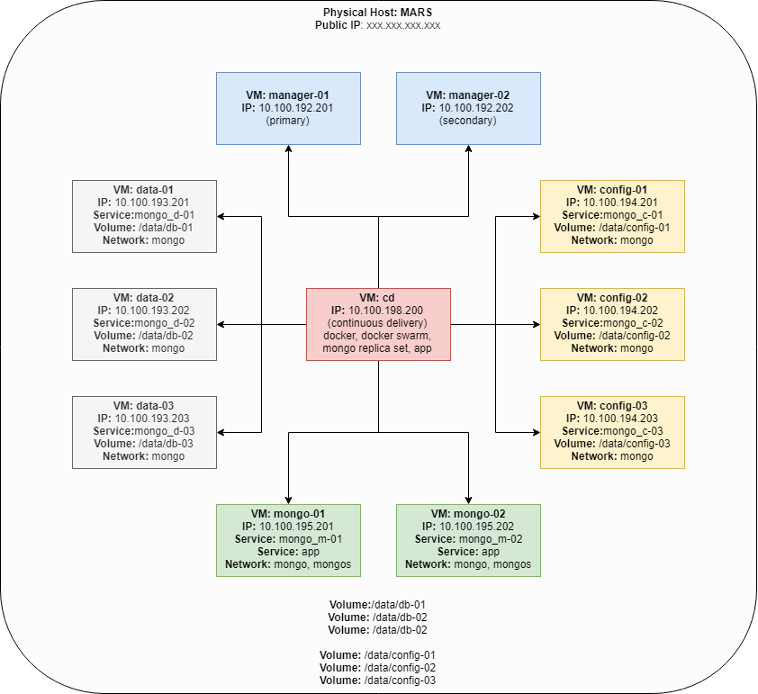

# Intro
Using this repo, you can automate the creation process of MongoDB ReplicaSets (optionally with Sharding Enabled) deployed inside a Docker Swarm using Vagrant (VirtualBox) and Ansible creating the following High Availablity architecture of VMs:

**cd**: Continous Delivery VM via which software is installed on the other VMs (Docker, Docker Swarm, Mongo, App etc)
**manager-01, manager-02**: 2x VMs for Docker Managers (manager-01 being the primary)
**data-01, data-02, data-03**: 3x VMs for storing data in the Mongo Data Instances (Replica Sets/Shards)
**config-01, config-02, config-03**: 3x VMs for Mongo Config Instances
**mongo-01, mongo-02**: 2x VMs for Mongo Instances (Router instances)

# Networks
- VM private network: 10.100.198.200, 10.100.193.20[1-2], 10.100.194.20[1-3], 10.100.194.20[1-3], 10.100.195.20[1-2]
- Docker Overlay Network:
  - **mongo**: subnet 11.0.0.0/24 - mongo cluster internal communication (data, config, mongos)
  - **mongos**: subnet 12.0.0.0/24 - mongo cluster external communication (app, mongos)
  
# Volumes
- `/data/db-01` - data-01 Volume
- `/data/db-02` - data-02 Volume
- `/data/db-03` - data-03 Volume

- `/data/config-01` - config-01 Volume
- `/data/config-02` - config-02 Volume
- `/data/config-03` - config-03 Volume

# VMs
- **cd**: Continous Delivery VM via which software is installed on the other VMs (Docker, Docker Swarm, Mongo, App etc)
  - **IP**: 10.100.198.200, **NETMASK**: 255.255.0.0

- **manager-01**: Primary docker manager node 
  - **IP**: 10.100.192.201, **NETMASK**: 255.255.0.0
- **manager-01**
  - Secondary docker manager node 
  - **IP**: 10.100.192.202, **NETMASK**: 255.255.0.0

- **data-01**: First data node - **datars** replica set with shards optionally
  - **IP**: 10.100.193.201, **NETMASK**: 255.255.0.0
  - **Docker Service**: mongo_d-01
  - **Docker Volume**: /data/db-01
  - **Docker Network**: mongo, **Subnet**: 11.0.0.0/24
- **data-02**: Second data node - **datars** replica set with shards optionally
  - **IP**: 10.100.193.202, **NETMASK**: 255.255.0.0
  - **Docker Service**: mongo_d-02
  - **Docker Volume**: /data/db-02
  - **Docker Network**: mongo, **Subnet**: 11.0.0.0/24
- **data-03**: Third data node - **datars** replica set with shards optionally
  - **IP**: 10.100.193.203, **NETMASK**: 255.255.0.0
  - **Docker Service**: mongo_d-03
  - **Docker Volume**: /data/db-03
  - **Docker Network**:
    - mongo, **Subnet**: 11.0.0.0/24

- **config-01**: First config node - **configrs** replica set
  - **IP**: 10.100.194.201, **NETMASK**: 255.255.0.0
  - **Docker Service**: mongo_c-01
  - **Docker Volume**: /data/config-01
  - **Docker Network**: mongo, **Subnet**: 11.0.0.0/24
- **config-02**: Second config node - **configrs** replica set
  - **IP**: 10.100.194.202, **NETMASK**: 255.255.0.0
  - **Docker Service**: mongo_c-02
  - **Docker Volume**: /data/config-02
  - **Docker Network**: mongo, **Subnet**: 11.0.0.0/24
- **config-03**: Third config node - **configrs** replica set
  - **IP**: 10.100.194.203, **NETMASK**: 255.255.0.0
  - **Docker Service**: mongo_c-03
  - **Docker Volume**: /data/config-03
  - **Docker Network**: mongo, **Subnet**: 11.0.0.0/24

- **mongo-01**: First mongo node (Router)
  - **IP**: 10.100.195.201, **NETMASK**: 255.255.0.0
  - **Docker Service**: mongo_m-01
  - **Docker Network**: mongo, **Subnet**: 11.0.0.0/24
  - **Docker Network**: mongos, **Subnet**: 12.0.0.0/24
- **mongo-02**: Second mongo node
  - **IP**: 10.100.195.202, **NETMASK**: 255.255.0.0
  - **Docker Service**: mongo_m-02
  - **Docker Network**: mongo, **Subnet**: 11.0.0.0/24
  - **Docker Network**: mongos, **Subnet**: 12.0.0.0/24

# Pre-requisites
- VirtualBox installed
- Vagrant installed

In addition, you need to create the Shared folders (between the Physical Host and your VMs) that will be used as Docker Volumes:
- `/data/db-01` - data-01 Volume
- `/data/db-02` - data-02 Volume
- `/data/db-03` - data-03 Volume

- `/data/config-01` - config-01 Volume
- `/data/config-02` - config-02 Volume
- `/data/config-03` - config-03 Volume

e.g. `mkdir db-01 db-02 db-03 config-01 config-02 config-03 & chmod 666 db-* config-*`

# Start the Cluster of VMs
`vagrant up` -> Start all VMs and install Docker on them

# Install Docker on all VMs
1. `vagrant ssh cd` -> login (ssh) to cd VM in order to bootstrap the Docker Swarm setup
2. `ansible-playbook /vagrant/ansible/docker.yml -i /vagrant/ansible/hosts/cluster`

# Initialize Docker Swarm
1. `vagrant ssh cd` -> login (ssh) to cd VM in order to bootstrap the Docker Swarm setup [skip this step if your are still logged in to cd VM]
2. `ansible-playbook /vagrant/ansible/swarm.yml -i /vagrant/ansible/hosts/cluster`

# Initialize Mongo Replicas/Shards
1. `vagrant ssh cd` -> login (ssh) to cd VM in order to bootstrap the Docker Swarm setup [skip this step if your are still logged in to cd VM]
2. `ansible-playbook /vagrant/ansible/mongo.yml -i /vagrant/ansible/hosts/cluster`
